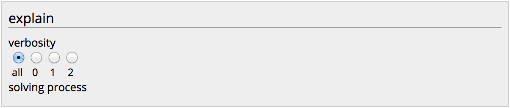

# RubikHelperUI
PanelUI extension for RubikHelper page

## Table of contents

- [Overview](#overview)
- [Scramble Panel](#scramble-panel)
- [Solve Panel](#solve-panel)
- [Explain Panel](#explain-panel)
- [Highlight Panel](#highlight-panel)
- [Setup Panel](#setup-panel)

## Overview

## Scramble Panel

- The user can use this tab to scramble the cube using the keyboard or the interface buttons
- It's case insensitive, so typing `f` or `F` will get the same result.
- The user can also use parenthesis for grouping moves and then close the group with `)'` to make it negative, `)i` to invert it or `)m` to mirror it (inverse rotation while swapping `L` with `R` and viceversa).
    - eg:  
`(FU'R)` = `FU'R`  
`(FU'R)'` = `F'UR'`  
`(FU'R)i` = `R'UF'`  
`(FU'R)m` = `F'UL'`  
`((FU'R)')m` = `FU'L`  
`((FU'R)i)m` = `LU'F`  
`(((FU'R)')i)m` = `L'UF'`
- Also use parenthesis to execute N times that group (eg. `(M'U)4 (MU)4`).
    - eg:  
`(FU'R)2` = `FU'RFU'R`  
`((FU'R)i)3` = `R'UF'R'UF'R'UF'`
- Use square brackets to write down a piece and obtaining the setup pattern (or the full pattern for pieces that don't have the setup/unsetup, like `DRB`).
- Every character written or every button pressed, the final "moves" sequence will be updated (expanding pieces Setup and other patterns) showing only simple rotations (for faces/slices/cube) with `+` for clockwise and `-` for counterclockwise rotations.
- Click on **execute** button to see the cube scrambled with the given sequence.
- Using the GUI the user can write the sequence using provided buttons.
- To write a piece:
    - click on **new** under "piece"
    - click on face buttons (two or three of them) in order to name the piece
    - note that each face button clicked disables all other face buttons that cannot be used, avoiding typo errors
    - click on the resulting piece button when complete in order to add it to the sequence
- To manage groups:
    - click on **(** button under "group"
    - compose the sequence
    - close the group clicking on any `)` button (see 3rd point of this list)

Note: to write a negative rotation (counterclockwise) use `i`, `'`, or `-` (eg. `F'` , `Fi` , `F-` are the same, just like `F` and `F+`).

some examples:
- scramble: `[dr] d'b (lu)' u2 (r'bu)4 [ulb]`
- scramble: `( (R U [BR])m )i F [LB] (F' [BL])'`
- `UF`: `(U2 M')2`
- `FR`: `URU'`
- `BR`: `([FR])i`
- `RU`: `x' ([BR])'`  
so, the full `RU` pattern is: `x' ([BR])' M2 (x' ([BR])')i`  
or, more easily: `[RU] M2 ([RU])i`

## Solve Panel

- Here the user can see the button **get pattern** which evaluate the scrambled cube and get the **M2R2 sequence** to solve it.
- Click on the **execute** button in this tab to watch it solve the cube!
- The **replay** feature currently allows the user to re-scramble the cube in order to execute the solve process once again.
- This tab accepts only pieces or faces comma separated.
    - eg. `RF,UR,LD,R-,B2,FUR,BLD`
- For each piece written here, it expands its pattern as full (ie. including `Setup, M2/R2, Unsetup`)

## Explain Panel

## Highlight Panel

This tab has teaching purposes only: it helps the user to identify pieces of the cube.

## Setup Panel

- Here the user can click on **edit cube** to setup the cube like a real one, so the tool can help the user to solve his own cube.
    - while "edit cube" is active, click on a cube's piece to show its position name and its current stickers
    - click on face buttons under "faces" to compose the piece name (see 9th point of [Scramble Panel](#scramble-panel))
    - note: only the same type of piece can be set (if edit an edge it will end editing after the second face clicked, for corners after the third)
- Click on **show back faces** to hide `F`,`R`,`U` faces and see only `L`,`B`,`D` back-faces (from the inside).
- Click on **get image** to save the current cube state as an image (use the browser's "save as.." command).
- The user can also choose the color for each cube's face to match the real cube (it could have colors not compliant with the original Rubik).
